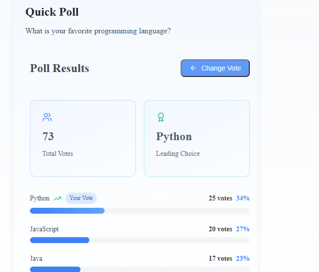

# Poll Application (React) 🌊✨

A React-based poll application where users can vote for their favorite options and view real-time results with smooth animations.

---

## 🌟 Features
- **Poll Display**: Four answer options with dynamic animations
- **Voting System**: Single-option voting
- **Real-Time Results**: Percentage-based visualization
- **Smooth Animations**: Framer Motion-powered transitions
- **Celebration Effect**: Confetti animation on submission
- **Responsive Design**: Optimized for mobile & desktop




---

## 🛠️ Tech Stack
- **React**: Component-based UI framework
- **Framer Motion**: Smooth animations and transitions
- **React Confetti**: Celebration effect on vote submission
- **Figma**: Design prototyping
- **TypeScript**: Type-safe development for better reliability

---

## 🐂️ Project Structure
```
src/
├── components/
│   ├── Poll.tsx
│   ├── VotingCard.tsx
│   ├── Results.tsx
│   └── ThankYouModal.tsx
├── styles/
│   ├── App.css
│   ├── Results.css
│   ├── VotingCard.css
│   └── ThankYouModal.css
├── App.tsx
└── index.tsx
```

---

## 🚀 Setup & Run
1. **Clone the Repository**:
   ```bash
   git clone https://github.com/chijex5/my-poll-project.git
   ```
2. **Navigate to Project Folder**:
   ```bash
   cd poll-app
   ```
3. **Install Dependencies**:
   ```bash
   npm install
   ```
4. **Start the Development Server**:
   ```bash
   npm start
   ```

---

## 🖱️ Usage
1. **Vote**: Click any option to submit your vote.
2. **View Results**: Toggle the results display.
3. **Re-Vote**: Change your vote by selecting another option.

---

### ⚡ Vercel
1. Import the project into Vercel.
2. Enable automated deployments from GitHub.

---

## 🎁 Bonus Features
- **Dynamic progress bars** with smooth transitions.
- **Vote count & percentage visualization**.
- **Grayscale filter** for disabled vote cards.
- **Loading animations** during state updates.

---

## 🐛 Error Handling
- Prevents multiple votes without refreshing.
- Graceful error handling during API calls.
- Validation checks for vote submissions.

---


## 💎 Contact
For any questions, email: [embroconnect3@gmail.com]


